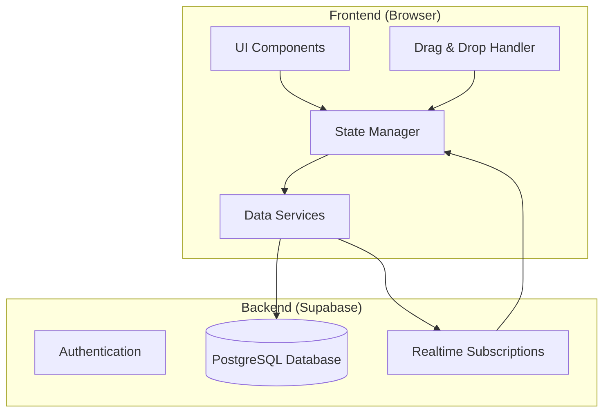
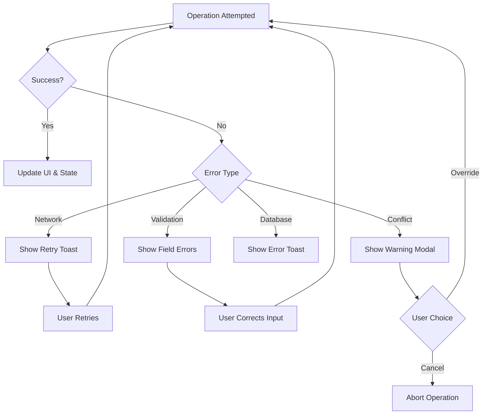

# Design Document: Consultant Resource Management System

## Overview

The Consultant Resource Management System is a single-page web application built with vanilla HTML, CSS, and JavaScript, using Supabase as the backend database. The application provides a visual interface for managing consultant talent pools, planning resource allocation via a drag-and-drop calendar, tracking project status and payments, and maintaining detailed talent profiles.

The system follows a modular architecture with clear separation between UI components, data services, and state management. All data is persisted to Supabase in real-time, ensuring data integrity and multi-device access.

## Architecture



### Application Structure

```
/
├── index.html              # Main entry point with navigation
├── css/
│   ├── main.css           # Global styles and variables
│   ├── components.css     # Reusable component styles
│   ├── calendar.css       # Calendar-specific styles
│   └── pages.css          # Page-specific styles
├── js/
│   ├── app.js             # Application initialization
│   ├── config.js          # Supabase configuration
│   ├── state.js           # Global state management
│   ├── router.js          # Client-side routing
│   ├── services/
│   │   ├── supabase.js    # Supabase client wrapper
│   │   ├── talents.js     # Talent CRUD operations
│   │   ├── projects.js    # Project CRUD operations
│   │   ├── allocations.js # Allocation CRUD operations
│   │   ├── areas.js       # Area CRUD operations
│   │   └── clients.js     # Client CRUD operations
│   ├── components/
│   │   ├── sidebar.js     # Talent pool sidebar
│   │   ├── calendar.js    # Calendar component
│   │   ├── legend.js      # Project color legend
│   │   ├── modal.js       # Modal dialogs
│   │   ├── toast.js       # Notification toasts
│   │   └── forms.js       # Form components
│   └── pages/
│       ├── dashboard.js   # Dashboard page
│       ├── calendar.js    # Calendar planning page
│       ├── projects.js    # Projects management page
│       ├── talents.js     # Talents list page
│       ├── talent-detail.js # Individual talent page
│       └── settings.js    # Settings/areas management
└── assets/
    └── icons/             # SVG icons
```

## Components and Interfaces

### Core Components

#### 1. State Manager (`state.js`)
Centralized state management using a simple pub/sub pattern.

```javascript
// State Manager Interface
const StateManager = {
    state: {
        talents: [],
        projects: [],
        allocations: [],
        areas: [],
        clients: [],
        ui: {
            currentPage: 'dashboard',
            selectedDate: null,
            draggedTalent: null,
            loading: false
        }
    },
    
    subscribe(key, callback),    // Subscribe to state changes
    setState(key, value),        // Update state and notify subscribers
    getState(key)                // Get current state value
};
```

#### 2. Talent Pool Sidebar (`sidebar.js`)
Displays draggable talent cards with availability indicators.

```javascript
// Sidebar Interface
const TalentSidebar = {
    render(container),           // Render sidebar to container
    filterByAvailability(date),  // Filter talents by date availability
    filterByArea(areaId),        // Filter talents by area
    setDragHandlers()            // Initialize drag event handlers
};
```

#### 3. Calendar Component (`calendar.js`)
Monthly calendar view with drag-and-drop allocation support.

```javascript
// Calendar Interface
const Calendar = {
    render(container, month, year),  // Render calendar for month/year
    setDropHandlers(),               // Initialize drop zones
    showAllocations(allocations),    // Display allocations on calendar
    navigateMonth(direction),        // Navigate to prev/next month
    onDateClick(callback),           // Handle date cell clicks
    onAllocationClick(callback)      // Handle allocation clicks
};
```

#### 4. Legend Component (`legend.js`)
Displays project color codes.

```javascript
// Legend Interface
const Legend = {
    render(container, projects),     // Render legend with projects
    update(projects)                 // Update legend when projects change
};
```

#### 5. Modal Component (`modal.js`)
Reusable modal dialog system.

```javascript
// Modal Interface
const Modal = {
    show(options),      // Show modal with title, content, actions
    hide(),             // Hide current modal
    confirm(message),   // Show confirmation dialog
    form(formConfig)    // Show form modal
};
```

### Data Services

#### Talent Service (`services/talents.js`)
```javascript
const TalentService = {
    async getAll(),
    async getById(id),
    async create(talentData),
    async update(id, talentData),
    async delete(id),
    async addSkill(talentId, skill),
    async removeSkill(talentId, skill),
    async assignArea(talentId, areaId),
    async removeArea(talentId, areaId),
    async getAssignmentHistory(talentId)
};
```

#### Project Service (`services/projects.js`)
```javascript
const ProjectService = {
    async getAll(),
    async getById(id),
    async create(projectData),
    async update(id, projectData),
    async delete(id),
    async updateStatus(id, status),
    async updatePaymentStatus(id, isPaid),
    async getByStatus(status),
    async getByClient(clientId),
    generateColor()  // Generate unique project color
};
```

#### Allocation Service (`services/allocations.js`)
```javascript
const AllocationService = {
    async getAll(),
    async getByDateRange(startDate, endDate),
    async getByTalent(talentId),
    async getByProject(projectId),
    async create(allocationData),
    async update(id, allocationData),
    async delete(id),
    async checkConflicts(talentId, startDate, endDate)
};
```

## Data Models

### Supabase Database Schema

```sql
-- Areas table
CREATE TABLE areas (
    id UUID PRIMARY KEY DEFAULT gen_random_uuid(),
    name VARCHAR(100) NOT NULL UNIQUE,
    created_at TIMESTAMP WITH TIME ZONE DEFAULT NOW(),
    updated_at TIMESTAMP WITH TIME ZONE DEFAULT NOW()
);

-- Clients table
CREATE TABLE clients (
    id UUID PRIMARY KEY DEFAULT gen_random_uuid(),
    name VARCHAR(200) NOT NULL,
    contact_email VARCHAR(255),
    contact_phone VARCHAR(50),
    notes TEXT,
    created_at TIMESTAMP WITH TIME ZONE DEFAULT NOW(),
    updated_at TIMESTAMP WITH TIME ZONE DEFAULT NOW()
);

-- Talents table
CREATE TABLE talents (
    id UUID PRIMARY KEY DEFAULT gen_random_uuid(),
    name VARCHAR(200) NOT NULL,
    email VARCHAR(255) UNIQUE,
    phone VARCHAR(50),
    skills TEXT[] DEFAULT '{}',
    photo_url VARCHAR(500),
    notes TEXT,
    created_at TIMESTAMP WITH TIME ZONE DEFAULT NOW(),
    updated_at TIMESTAMP WITH TIME ZONE DEFAULT NOW()
);

-- Talent-Area junction table
CREATE TABLE talent_areas (
    talent_id UUID REFERENCES talents(id) ON DELETE CASCADE,
    area_id UUID REFERENCES areas(id) ON DELETE CASCADE,
    PRIMARY KEY (talent_id, area_id)
);

-- Projects table
CREATE TABLE projects (
    id UUID PRIMARY KEY DEFAULT gen_random_uuid(),
    name VARCHAR(200) NOT NULL,
    description TEXT,
    client_id UUID REFERENCES clients(id) ON DELETE SET NULL,
    color VARCHAR(7) NOT NULL,  -- Hex color code
    status VARCHAR(20) DEFAULT 'in_progress' CHECK (status IN ('in_progress', 'completed', 'canceled')),
    is_paid BOOLEAN DEFAULT FALSE,
    start_date DATE,
    end_date DATE,
    budget DECIMAL(15, 2),
    created_at TIMESTAMP WITH TIME ZONE DEFAULT NOW(),
    updated_at TIMESTAMP WITH TIME ZONE DEFAULT NOW()
);

-- Allocations table
CREATE TABLE allocations (
    id UUID PRIMARY KEY DEFAULT gen_random_uuid(),
    talent_id UUID REFERENCES talents(id) ON DELETE CASCADE,
    project_id UUID REFERENCES projects(id) ON DELETE CASCADE,
    start_date DATE NOT NULL,
    end_date DATE NOT NULL,
    notes TEXT,
    created_at TIMESTAMP WITH TIME ZONE DEFAULT NOW(),
    updated_at TIMESTAMP WITH TIME ZONE DEFAULT NOW(),
    CONSTRAINT valid_date_range CHECK (end_date >= start_date)
);

-- Indexes for performance
CREATE INDEX idx_allocations_talent ON allocations(talent_id);
CREATE INDEX idx_allocations_project ON allocations(project_id);
CREATE INDEX idx_allocations_dates ON allocations(start_date, end_date);
CREATE INDEX idx_projects_status ON projects(status);
CREATE INDEX idx_projects_client ON projects(client_id);
```

### JavaScript Data Models

```javascript
// Talent Model
const Talent = {
    id: 'uuid',
    name: 'string',
    email: 'string',
    phone: 'string',
    skills: ['string'],
    areas: ['uuid'],  // Area IDs
    photo_url: 'string',
    notes: 'string',
    created_at: 'timestamp',
    updated_at: 'timestamp'
};

// Project Model
const Project = {
    id: 'uuid',
    name: 'string',
    description: 'string',
    client_id: 'uuid',
    color: 'string',  // #RRGGBB format
    status: 'in_progress' | 'completed' | 'canceled',
    is_paid: 'boolean',
    start_date: 'date',
    end_date: 'date',
    budget: 'number',
    created_at: 'timestamp',
    updated_at: 'timestamp'
};

// Allocation Model
const Allocation = {
    id: 'uuid',
    talent_id: 'uuid',
    project_id: 'uuid',
    start_date: 'date',
    end_date: 'date',
    notes: 'string',
    created_at: 'timestamp',
    updated_at: 'timestamp'
};

// Area Model
const Area = {
    id: 'uuid',
    name: 'string',
    created_at: 'timestamp',
    updated_at: 'timestamp'
};

// Client Model
const Client = {
    id: 'uuid',
    name: 'string',
    contact_email: 'string',
    contact_phone: 'string',
    notes: 'string',
    created_at: 'timestamp',
    updated_at: 'timestamp'
};
```


## Correctness Properties

*A property is a characteristic or behavior that should hold true across all valid executions of a system-essentially, a formal statement about what the system should do. Properties serve as the bridge between human-readable specifications and machine-verifiable correctness guarantees.*

Based on the acceptance criteria analysis, the following correctness properties must be validated through property-based testing:

### Property 1: Talent CRUD Round-Trip Consistency
*For any* valid talent data, creating a talent and then fetching all talents SHALL return a list containing a talent with matching data fields.
**Validates: Requirements 1.1, 1.5**

### Property 2: Talent Update Persistence
*For any* existing talent and any valid modification, updating the talent and then fetching it by ID SHALL return the modified data.
**Validates: Requirements 1.2**

### Property 3: Talent Deletion Completeness
*For any* existing talent, deleting the talent and then fetching all talents SHALL return a list that does not contain that talent's ID.
**Validates: Requirements 1.3**

### Property 4: Allocation Creation Round-Trip
*For any* valid allocation data (talent, project, date range), creating an allocation and then fetching allocations for that date range SHALL include the created allocation.
**Validates: Requirements 2.2, 2.5**

### Property 5: Calendar Allocation Display Completeness
*For any* set of allocations within a month, rendering the calendar SHALL produce elements for each allocation with the correct project color.
**Validates: Requirements 2.3**

### Property 6: Project Color Uniqueness
*For any* set of projects, each project SHALL have a unique color value that differs from all other projects.
**Validates: Requirements 3.1, 3.5**

### Property 7: Project Cascade Delete
*For any* project with associated allocations, deleting the project SHALL also remove all allocations referencing that project.
**Validates: Requirements 3.3**

### Property 8: Legend Completeness
*For any* set of active projects, the rendered legend SHALL contain an entry for each project with its assigned color.
**Validates: Requirements 3.4**

### Property 9: Project Status Update Persistence
*For any* project and any valid status value (in_progress, completed, canceled), updating the status and then fetching the project SHALL return the updated status.
**Validates: Requirements 4.1, 4.2, 4.3**

### Property 10: Completed Projects Filter Accuracy
*For any* set of projects with mixed statuses, filtering by "completed" status SHALL return exactly the projects with status "completed".
**Validates: Requirements 4.2, 5.1**

### Property 11: Payment Status Update Persistence
*For any* completed project, updating the payment status to paid and then fetching SHALL return is_paid as true.
**Validates: Requirements 5.2**

### Property 12: Payment Status Filter Accuracy
*For any* set of completed projects with mixed payment statuses, filtering by payment status SHALL return exactly the matching projects.
**Validates: Requirements 5.3**

### Property 13: Talent Skills Modification Persistence
*For any* talent and any skill string, adding the skill and then fetching the talent SHALL include that skill in the skills array.
**Validates: Requirements 6.2**

### Property 14: Talent Area Assignment Persistence
*For any* talent and any valid area, assigning the area and then fetching the talent's areas SHALL include that area.
**Validates: Requirements 6.3**

### Property 15: Talent Assignment History Completeness
*For any* talent with allocations, fetching assignment history SHALL return all allocations where talent_id matches.
**Validates: Requirements 6.4**

### Property 16: Area CRUD Round-Trip
*For any* valid area name, creating an area and then fetching all areas SHALL include an area with that name.
**Validates: Requirements 7.1**

### Property 17: Area Deletion Cascade
*For any* area assigned to talents, deleting the area SHALL remove that area from all talent_areas records.
**Validates: Requirements 7.3**

### Property 18: Dashboard Metrics Accuracy
*For any* set of talents, projects, and allocations, the dashboard metrics SHALL correctly calculate: talent count equals talents.length, active projects count equals projects filtered by in_progress status, utilization percentage equals (allocated talent-days / total talent-days) * 100.
**Validates: Requirements 8.1**

### Property 19: Upcoming Deadlines Filter
*For any* set of projects with various end dates, filtering for upcoming deadlines SHALL return exactly projects with end_date within 30 days from current date.
**Validates: Requirements 8.2**

### Property 20: Talent Availability Calculation
*For any* talent and date, the availability status SHALL be "unavailable" if and only if there exists an allocation where the date falls within [start_date, end_date].
**Validates: Requirements 9.1, 9.2**

### Property 21: Allocation Conflict Detection
*For any* talent with existing allocations, attempting to create an overlapping allocation SHALL be detected as a conflict.
**Validates: Requirements 9.3**

### Property 22: Client-Project Association
*For any* project created with a client_id, fetching projects by that client_id SHALL include the created project.
**Validates: Requirements 10.1, 10.2**

### Property 23: Initial Data Load Completeness
*For any* database state, loading the application SHALL retrieve all talents, projects, allocations, areas, and clients.
**Validates: Requirements 11.2**

## Error Handling

### Error Categories

1. **Network Errors**: Connection failures to Supabase
   - Display toast notification with retry option
   - Cache pending operations for retry
   - Show offline indicator in UI

2. **Validation Errors**: Invalid user input
   - Display inline error messages on form fields
   - Prevent form submission until errors resolved
   - Highlight invalid fields with red border

3. **Conflict Errors**: Scheduling conflicts, duplicate entries
   - Display warning modal with conflict details
   - Offer options to override or cancel
   - Log conflict for audit purposes

4. **Database Errors**: Constraint violations, foreign key errors
   - Display user-friendly error message
   - Log technical details for debugging
   - Suggest corrective action

### Error Response Format

```javascript
const ErrorResponse = {
    type: 'network' | 'validation' | 'conflict' | 'database',
    message: 'string',        // User-friendly message
    details: 'string',        // Technical details (for logging)
    field: 'string',          // For validation errors
    retryable: 'boolean',
    suggestedAction: 'string'
};
```

### Error Handling Flow



## Testing Strategy

### Unit Testing

Unit tests will be written using a lightweight testing approach with vanilla JavaScript. Tests will cover:

- **Service Functions**: Each CRUD operation in data services
- **State Management**: State updates and subscriber notifications
- **Utility Functions**: Date calculations, color generation, validation
- **Component Rendering**: DOM output verification

Test file structure:
```
/tests/
├── services/
│   ├── talents.test.js
│   ├── projects.test.js
│   ├── allocations.test.js
│   └── ...
├── components/
│   ├── calendar.test.js
│   ├── sidebar.test.js
│   └── ...
└── utils/
    ├── dates.test.js
    ├── colors.test.js
    └── validation.test.js
```

### Property-Based Testing

Property-based tests will use **fast-check** library to verify correctness properties. Each property test will:

- Run a minimum of 100 iterations with randomly generated inputs
- Be tagged with the corresponding correctness property reference
- Use format: `**Feature: consultant-resource-manager, Property {number}: {property_text}**`

Example property test structure:
```javascript
import fc from 'fast-check';

// **Feature: consultant-resource-manager, Property 1: Talent CRUD Round-Trip Consistency**
test('Talent CRUD Round-Trip', () => {
    fc.assert(
        fc.property(
            fc.record({
                name: fc.string({ minLength: 1, maxLength: 200 }),
                email: fc.emailAddress(),
                skills: fc.array(fc.string())
            }),
            async (talentData) => {
                const created = await TalentService.create(talentData);
                const all = await TalentService.getAll();
                return all.some(t => t.id === created.id && t.name === talentData.name);
            }
        ),
        { numRuns: 100 }
    );
});
```

### Integration Testing

Integration tests will verify:
- Supabase connection and operations
- Component interactions
- Page navigation flows
- Drag-and-drop functionality

### Test Execution

Tests can be run via:
```bash
npm test              # Run all tests
npm test:unit         # Run unit tests only
npm test:property     # Run property-based tests only
npm test:integration  # Run integration tests only
```
